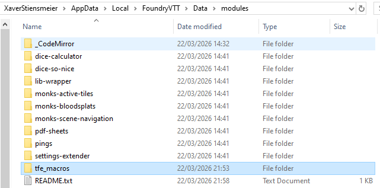
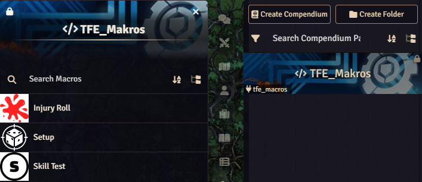
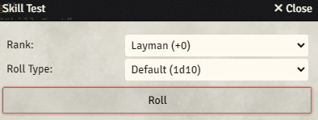
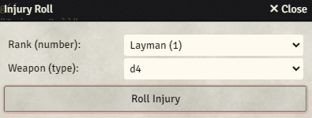

# Tales From Elsewhere Foundry Macros
Macros For Tales From Elsewhere (fanmade). 

This is the first Foundry module I have ever written. Likely there are better ways to handle this. It might contain errors.

This module does not intend to handle everything, but together with https://foundryvtt.com/packages/pdf-sheets it should help you run TFE sessions on Foundry.

I do not intend to develope a full TFE Foundry system. I am just sharing what I wrote for myself.

## Installation

Just download this repository (Code>Download Zip) and drop the unpacked tfe_macros folder into your data/modules folder. See https://foundryvtt.com/article/modules/

After successful installation, activate the module in a world via Game Settings>Manage Modules. The compendium should then be listed under "Compendium Packs".

## Macros

### Setup

Executing the setup macro will replace the first two slots in the quick access bar with the "Skill Test" and "Injury Roll" macros. This is GM only.

### Skill Test

First select your skill's rank. Then select default, high roll or low roll.

### Injury Roll

First select your skill's rank. Then select the dice type (e.g. d12) based on your weapon.

